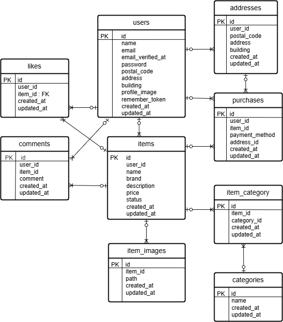

# フリマアプリ(techfle)

## 環境構築手順

### Dockerビルド
```
1. git clone git@github.com:aki5538/techfle.git
2. cd techfle
3. DockerDesktopアプリを立ち上げる
4. docker compose up -d --build
```

### Laravelの環境構築
```
1. docker compose exec php bash
2. composer install
3. 「.env.example」ファイルをコピーして新しく.envファイルを作成
4. .envに以下の環境変数を追加

DB_CONNECTION=mysql
DB_HOST=mysql
DB_PORT=3306
DB_DATABASE=laravel_db
DB_USERNAME=laravel_user
DB_PASSWORD=laravel_pass

```
5.アプリケーションキーの作成
```
php artisan key:generate
```
6.マイグレーション＆シーディング
```
php artisan migrate --seed
```

7.シンボリックリンク作成
```
php artisan storage:link
```

## 使用技術

認証
- Laravel Fortify

バリデーション
- FormRequest

メール送信
- Mailhog

決済
- Stripe

その他
- PHP 8.1
- Laravel 8.75
- MySQL 8.0.26
- nginx 1.21.1

## 環境変数(追加設定)

### Mailhog(メール認証用)
```
MAIL_MAILER=smtp
MAIL_HOST=mailhog
MAIL_PORT=1025
MAIL_USERNAME=null
MAIL_PASSWORD=null
MAIL_ENCRYPTION=null
MAIL_FROM_ADDRESS="no-reply@example.com"
MAIL_FROM_NAME="${APP_NAME}"
```

### Stripe(決済機能用)
```
STRIPE_KEY=your_stripe_public_key
STRIPE_SECRET=your_stripe_secret_key
```

## テスト環境のセットアップ

1. .env.testingを作成
```
cp .env.example .env.testing
```

2. .env.testingにテスト用DBを設定
```
DB_CONNECTION=mysql
DB_HOST=mysql
DB_PORT=3306
DB_DATABASE=demo_test
DB_USERNAME=laravel_user
DB_PASSWORD=laravel_pass
```

3. テスト用データベースを作成
```
docker compose exec mysql bash
mysql -u root
CREATE DATABASE demo_test;
exit;
```

4. テスト用DBにmigrate＆seed
```
docker compose exec php bash
php artisan migrate --seed --env=testing
```
## テスト実行
```
docker compose exec php bash
php artisan test
```

## ER図


## 動作URL

- 開発環境 : http://localhost/
- phpMyAdmin : http://localhost:8080/

